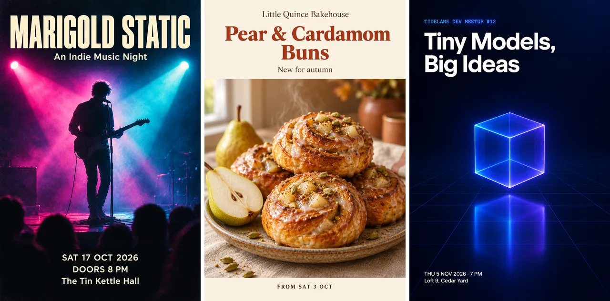

# AI Poster Maker Skill

[English](./README.md) | 简体中文

把一段活动描述、一张产品照片或品牌参考图，做成活动海报、宣传 banner 或社交媒体配图，视觉层级清晰、风格贴合品类，并预留文字区域，在 Claude Code、Codex 或 OpenClaw 里直接完成。

> [!IMPORTANT]
> 生成需要 [Beatra](https://beatra.ai) 账号并消耗积分，安装本身不收费。

| 问题 | 回答 |
| --- | --- |
| **能做什么** | 将一段活动描述、一张产品照片或品牌参考图，转化为抓人眼球的活动海报、宣传 banner 或社交媒体配图，搭配清晰视觉层级、按品类匹配的风格和预留文字区域。 |
| **运行要求** | Python 3.10+，以及能加载 `SKILL.md` 的 Agent |
| **费用** | 安装免费。每次生成消耗 Beatra 账号积分，只有你明确要求这次生成或批准确认卡后才会付费。 |
| **支持的 Agent** | Claude Code、Codex、OpenClaw |

<p align="center"></p>

*根据简短需求生成的三张 2:3 海报：虚构独立音乐之夜 Marigold Static 的活动海报、虚构烘焙店 Little Quince Bakehouse 的秋季新品海报，以及虚构开发者聚会 Tidelane Dev Meetup 的极简海报。由 Beatra AI 生成。*

| Skill | Entry point | Version |
| --- | --- | --- |
| [`poster-design-studio`](skills/poster-design-studio) | [SKILL.md](skills/poster-design-studio/SKILL.md) | 0.1.6 |

本仓库由 [beatra-ai/beatra-skills](https://github.com/beatra-ai/beatra-skills/tree/main/skills/poster-design-studio) 自动发布，问题请到那里反馈。

## 安装

使用 [`skills`](https://skills.sh) CLI：

```bash
npx skills add beatra-ai/ai-poster-maker-skill
```

使用 GitHub CLI：

```bash
gh skill install beatra-ai/ai-poster-maker-skill poster-design-studio
```

也可以克隆本仓库，把 `skills/poster-design-studio` 复制到 `~/.claude/skills/`（Claude Code）、`~/.agents/skills/`（Codex）或 `~/.openclaw/skills/`（OpenClaw）。

或者把下面这段话发给你的 Agent：

```text
从 https://github.com/beatra-ai/ai-poster-maker-skill 安装 poster-design-studio skill（目录 skills/poster-design-studio），然后按它的 SKILL.md 连接我的 Beatra 账号。
```

## 你能得到什么

- **为吸引注意力而生** — 清晰的视觉层级把一个焦点主体放在视觉中心，搭配干净的预留文字区域，让大标题和详情完美落地，不与画面冲突。
- **按品类匹配风格** — 科技风干净未来感，美食风温暖诱人，音乐风活力四射，时尚风杂志感大胆。海报风格自动匹配你的主体品类。
- **任意画布，任意场景** — A 系列印刷宣传单、1:1 社交方图、9:16 快拍、16:9 banner、2:3 / 3:4 标准海报——一份简报，按印刷或社交选择合适的画布。

## 适用场景

- **活动与音乐海报** — 活力四射的活动海报与音乐节海报，搭配大标题区域、单一表演者或主视觉，以及结构化的日期场地信息块。
- **电影与产品发布会海报** — 戏剧化光效与片名区域的影院级电影海报，加上干净未来感、把产品放在视觉中心的产品发布会海报。
- **促销宣传单与宣传 banner** — 温暖诱人的促销宣传单和高对比度宣传 banner，搭配主推优惠区域、产品支撑和清晰的行动号召。
- **社交媒体配图** — 平台原生 1:1、9:16、16:9 社交配图，单一焦点主体、大块预留文字区域和高对比度可读性。

## 常见问题

### 只用一段主题描述就能生成海报吗？

可以。描述你的活动、促销、电影或活动方案以及风格方向，工具会从描述生成完整的海报视觉，搭配你选择的画布和预留文字区域。

### 能把产品照片变成发布会海报吗？

可以。上传产品照片，工具会把它转化为精致的发布会海报，搭配干净背景、品牌色彩风格和预留文字区域，用于放置标题和日期。

### 海报会留出放标题和详情的位置吗？

会的。每张海报都预留干净的文字区域——上部、居中或下部——让你放置标题、日期和行动号召时不与画面冲突。

### 能修复已认可海报的某个区域吗？

可以。上传已认可的海报，描述需要修复的地方——杂物角落、色温或标题对比度——编辑只针对该区域，不改变其他部分。

## 更新

安装后的 skill 每天最多检查一次新版本，替换前先校验官方归档，任何一步失败都不会动你已安装的版本。
随时可以关闭，见 skill 内的 `references/automatic-updates-and-safety.md`。

## 许可证

[MIT-0](LICENSE)：可自由使用、修改和再分发，包括商用，无需署名；与这些 skill 在 ClawHub 上的条款一致。
